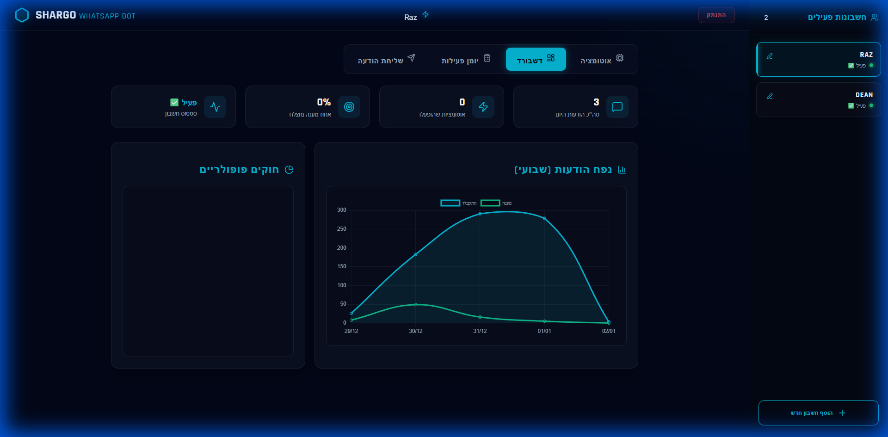
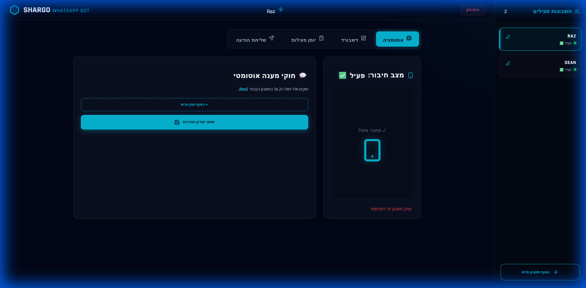
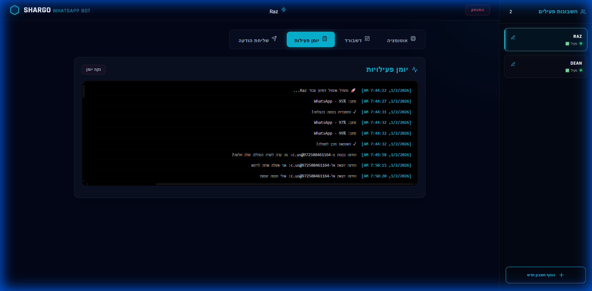

# 🤖 Shargo WhatsApp Bot | Hub & Analytics v1.1.0

מערכת Enterprise לניהול אוטומציות וואטסאפ מרובות חשבונות, הכוללת ממשק ניהול בסטנדרט גבוה, דשבורד אנליטיקה חכם, ותמיכה מלאה ב-Webhooks ואוטומציות מורכבות.

---

## 🖼️ מבט על המערכת

### 📊 דשבורד אנליטיקה (לפי חשבון)


### ⚙️ ניהול אוטומציות וחוקים


### 📜 יומן פעילות חי


---

## ✨ תכונות חדשות (v1.1.0)

- **🔄 Auto-Healing & Resilience**: מערכת שמשחזרת את עצמה באופן אוטומטי במקרה של ניתוקים.
- **🏥 Health Check Endpoints**: נקודות קצה חדשות לבדיקת בריאות המערכת והסשנים.
- **🐳 Docker Integration**: בדיקות בריאות ברמת הקונטיינר (Docker Healthcheck).
- **👥 ריבוי חשבונות (Multi-Session)**: ניהול מלא של מספר מספרים במקביל.

---

## 📡 API Documentation

המערכת מספקת API REST מלא לניהול ושליחת הודעות.

### 🏥 System Status

#### **1. בדיקת בריאות כללית**
בודק האם השרת למעלה והאם הוא מגיב.
```http
GET /api/health
```
**תגובה:**
```json
{
  "status": "ok",
  "message": "WhatsApp Bot is running",
  "timestamp": "2026-01-03T21:44:00.000Z",
  "sessions": 2
}
```

#### **2. בדיקת בריאות לסשן ספציפי**
בודק האם סשן מסוים מחובר ומוכן לשליחה. מומלץ להשתמש לפני שליחת הודעה.
```http
GET /api/session-health/:sessionId
```
**תגובה (תקין):**
```json
{
  "healthy": true,
  "status": "READY",
  "sessionId": "default",
  "uptime": 3600000
}
```

### 📩 Messaging

#### **3. שליחת הודעה**
שליחת הודעת טקסט למספר או קבוצה.
```http
POST /api/send-message
```
**Body:**
```json
{
  "to": "972501234567",       // מספר (עם קידומת, ללא +) או ID של קבוצה
  "message": "הודעה מהבוט",
  "sessionId": "default"      // מזהה הסשן ממנו תשלח ההודעה
}
```

### 🔐 Session Management

#### **4. קבלת רשימת סשנים**
מחזיר את כל הסשנים הפעילים והסטטוס שלהם.
```http
GET /api/sessions
```

#### **5. יצירת סשן חדש**
```http
POST /api/sessions
```
**Body:**
```json
{
  "id": "marketing_bot"
}
```

#### **6. התנתקות ומחיקת סשן**
```http
DELETE /api/sessions/:id
```

#### **7. שינוי שם סשן**
```http
POST /api/sessions/rename
```
**Body:**
```json
{
  "oldId": "old_name",
  "newId": "new_name"
}
```

### ⚙️ Configuration & Utils

#### **8. קריאת קונפיגורציה**
```http
GET /api/config?sessionId=default
```

#### **9. עדכון קונפיגורציה**
```http
POST /api/config?sessionId=default
```
**Body:** (אובייקט ההגדרות המלא)

#### **10. קריאת לוגים**
```http
GET /api/logs?sessionId=default
```

#### **11. קבלת סטטיסטיקות**
```http
GET /api/stats
```

---

## 🚀 התקנה מהירה

### דרישות קדם
- [Docker](https://www.docker.com/) & [Docker Compose](https://docs.docker.com/compose/)

### שלבי הרצה
1. שכפל את המאגר:
   ```bash
   git clone https://github.com/tazgaz/web-whatsapp-local-bot.git
   cd web-whatsapp-local-bot
   ```

2. הרץ את המכולות:
   ```bash
   docker-compose up -d --build
   ```

3. פתח את הממשק בדפדפן:
   `http://localhost:3000`

---

## 🛠️ טכנולוגיות
- **Core**: Node.js, Express, Socket.io
- **WhatsApp**: [whatsapp-web.js](https://github.com/pedroslopez/whatsapp-web.js)
- **Infra**: Docker & Docker Compose

---

## 👨‍💻 פיתוח
פותח על ידי **Antigravity** עבור **Shargo | Experts in Business Automation**.
